# City Explorer Challenge - Project Walkthrough

This document is designed as a visual guide for the final project screencast. It covers the application goal, architecture, main modules, API integration, location-based challenge generation, local storage, user flow, screens, and tests.

## Final Project Video

[Open the final project video](./Final%20project%20Video.mp4)

<video controls src="./Final%20project%20Video.mp4" title="City Explorer Challenge final project video"></video>

If the embedded player does not render on GitHub, use the link above to open or download the video.

## 1. Project Overview

**City Explorer Challenge** is an Android app that motivates users to discover nearby places by generating dynamic location-based missions.

Instead of showing a static list of saved places, the app:

- reads the user's current location,
- downloads nearby OpenStreetMap places through the Overpass API,
- applies challenge generation rules,
- stores active/completed/expired missions in Room,
- shows the mission on the Home, Details, Map, History, and Statistics screens,
- verifies completion when the user is close enough to the target.

### Main Idea

```mermaid
flowchart LR
    User["User opens app"] --> Location["Get current location"]
    Location --> API["Fetch nearby places from Overpass"]
    API --> Rules["Apply challenge generation rules"]
    Rules --> Mission["Create active mission"]
    Mission --> Map["Show target on map"]
    Map --> Completion["Check completion within 150 m"]
    Completion --> History["Save result in Room history"]
    History --> Stats["Update statistics"]
```


## 3. Architecture Diagram

The app follows an MVVM-style architecture with a shared `MainViewModel`.

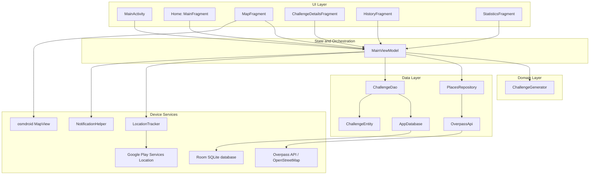

## 4. Project Structure

```text
com.example.cityexplorerchallenge/
|-- MainActivity.kt
|-- data/
|   |-- local/
|   |   |-- AppDatabase.kt
|   |   |-- ChallengeDao.kt
|   |   `-- ChallengeEntity.kt
|   `-- remote/
|       |-- OverpassApi.kt
|       |-- PlaceDto.kt
|       `-- PlacesRepository.kt
|-- domain/
|   `-- ChallengeGenerator.kt
|-- location/
|   `-- LocationTracker.kt
|-- notifications/
|   `-- NotificationHelper.kt
`-- ui/
    |-- MainViewModel.kt
    |-- main/MainFragment.kt
    |-- map/MapFragment.kt
    |-- details/ChallengeDetailsFragment.kt
    |-- history/
    |   |-- HistoryFragment.kt
    |   `-- HistoryAdapter.kt
    `-- statistics/StatisticsFragment.kt
```

### Resource Structure

```text
res/
|-- layout/
|   |-- activity_main.xml
|   |-- fragment_main.xml
|   |-- fragment_map.xml
|   |-- fragment_challenge_details.xml
|   |-- fragment_history.xml
|   |-- fragment_statistics.xml
|   `-- item_challenge_history.xml
|-- menu/
|   `-- bottom_nav_menu.xml
|-- navigation/
|   `-- nav_graph.xml
`-- values/
    |-- colors.xml
    |-- strings.xml
    `-- themes.xml
```

## 5. Core Modules Explained

### 5.1 MainActivity

`MainActivity` is the app entry point.

| Responsibility | Implementation |
|---|---|
| Inflate root layout | Uses `ActivityMainBinding` |
| Configure navigation | Connects `NavHostFragment` with `BottomNavigationView` |
| Request location permissions | Requests fine and coarse location |
| Start location tracking | Calls `viewModel.startTracking()` |
| Auto-generate first mission | Calls `viewModel.autoGenerateIfNeeded()` |
| Request notification permission | Requests `POST_NOTIFICATIONS` on Android 13+ |

Key idea:

```kotlin
if (hasLocationPermission()) {
    onLocationPermissionGranted()
} else {
    locationPermissionRequest.launch(
        arrayOf(
            Manifest.permission.ACCESS_FINE_LOCATION,
            Manifest.permission.ACCESS_COARSE_LOCATION
        )
    )
}
```

### 5.2 MainViewModel

`MainViewModel` is the central coordinator.

It connects:

- `LocationTracker` for location,
- `PlacesRepository` for OpenStreetMap data,
- `ChallengeGenerator` for rules,
- `ChallengeDao` for persistence,
- `NotificationHelper` for mission notifications.

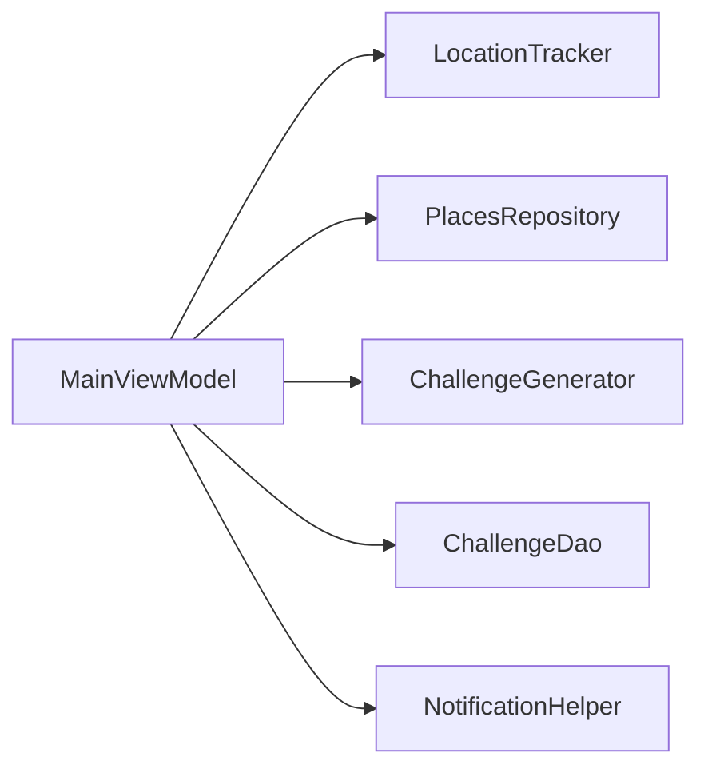

State exposed to the UI:

| StateFlow | Purpose |
|---|---|
| `activeChallenge` | Current active mission |
| `isLoading` | Loading state while generating a mission |
| `message` | Snackbar/Toast messages |
| `currentLocation` | Last usable device location |
| `locationStatus` | Human-readable location status |
| `historyFlow` | Completed and expired missions from Room |

### 5.3 LocationTracker

`LocationTracker` wraps Google Play Services location APIs.

Main responsibilities:

- check fine/coarse location permission,
- request a fresh current location,
- fallback to recent last-known location,
- start continuous location updates,
- reject unusable emulator/default locations,
- calculate distance between coordinates.

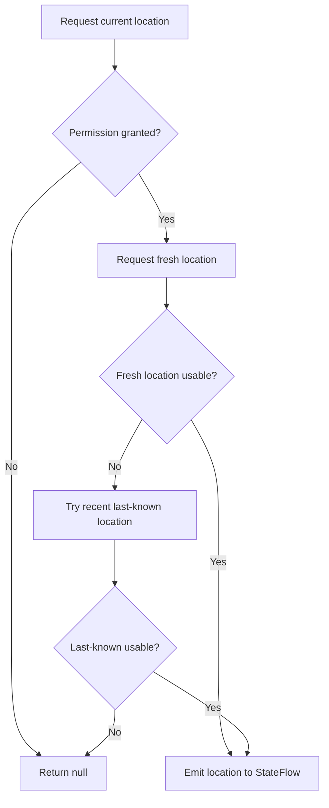

Invalid-location protection:

| Rejected location | Why |
|---|---|
| `0.0, 0.0` | Usually means no real GPS fix |
| Googleplex default emulator location | Avoids fake default Android Studio location |

### 5.4 External API: Overpass and OpenStreetMap

The app uses:

```text
https://overpass-api.de/api/
```

No API key is required.

`PlacesRepository` builds an Overpass query based on:

- current latitude,
- current longitude,
- search radius,
- requested category.

Supported categories:

| Category | OpenStreetMap tags |
|---|---|
| Nature | `leisure=park`, `garden`, `nature_reserve`, `boundary=protected_area` |
| Culture | `historic=monument`, `memorial`, `ruins`, `castle`, `tourism=museum`, `attraction`, `artwork` |
| Food | `amenity=restaurant`, `cafe`, `fast_food`, `bar` |
| Sport | `leisure=sports_centre`, `pitch`, `stadium`, `swimming_pool` |

Data flow:

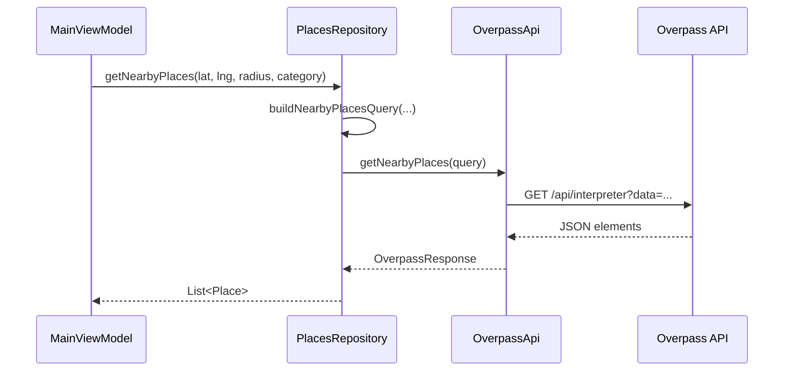

Example query shape:

```text
[out:json][timeout:25];(
  node(around:1500,50.0614,19.9366)["amenity"~"restaurant|cafe|fast_food|bar"];
  way(around:1500,50.0614,19.9366)["amenity"~"restaurant|cafe|fast_food|bar"];
  relation(around:1500,50.0614,19.9366)["amenity"~"restaurant|cafe|fast_food|bar"];
);out center 30;
```

### 5.5 Challenge Generation Engine

The mission generation logic lives in `ChallengeGenerator`.

Input:

- current latitude,
- current longitude,
- nearby places,
- recent mission history.

Output:

- a new `ChallengeEntity`, or `null` if no places are available.

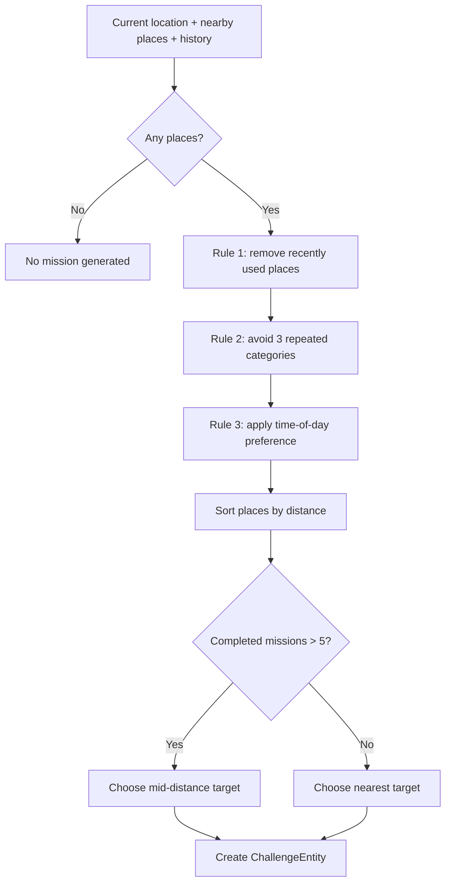

### 5.6 Local Persistence: Room

Room stores missions in the `challenges` table.

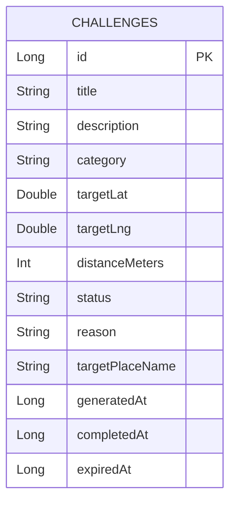

Possible statuses:

| Status | Meaning |
|---|---|
| `ACTIVE` | Current mission |
| `COMPLETED` | User reached the target radius |
| `EXPIRED` | Mission was replaced by a new generated mission |

DAO operations:

| DAO method | Purpose |
|---|---|
| `insert(challenge)` | Save a new mission |
| `update(challenge)` | Update completed status |
| `getActiveChallenge()` | Load active mission once |
| `getActiveChallengeFlow()` | Observe active mission |
| `expireActiveChallenges(expiredAt)` | Expire old active mission |
| `getHistoryFlow()` | Observe completed/expired missions |
| `getRecentChallenges(limit)` | Load history for generation rules |

### 5.7 Notifications

`NotificationHelper` shows local notifications when permission is granted.

Notifications implemented:

| Event | Notification |
|---|---|
| Mission generated | "New exploration mission" |
| Mission completed | "Mission completed" |

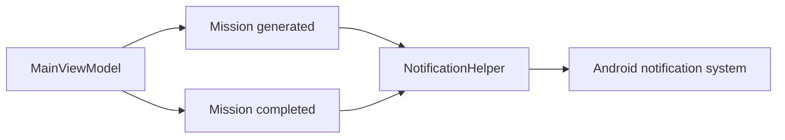

> [!IMPORTANT]
> Notifications are optional on Android 13+. If the user denies notification permission, the app still works using in-app Toast/Snackbar messages.

## 6. Main User Flow

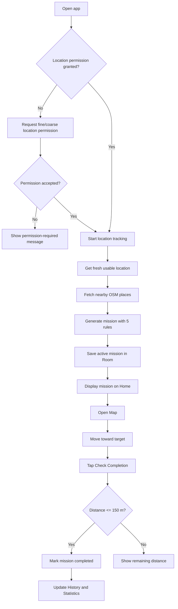

## 7. Screens Overview

### 7.1 Home Screen

Layout: `fragment_main.xml`  
Fragment: `MainFragment`

Shows:

- app title,
- location status,
- active mission card,
- category,
- distance,
- status,
- progress summary,
- buttons for map, details, new mission, and location refresh.

Data source:

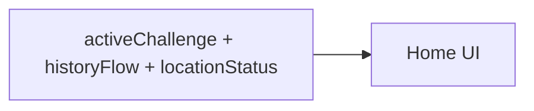

### 7.2 Map Screen

Layout: `fragment_map.xml`  
Fragment: `MapFragment`

Shows:

- osmdroid map,
- user marker,
- target marker,
- straight-line route indicator,
- completion radius circle,
- live distance,
- button to check completion.

Completion radius:

```text
150 meters
```

> [!NOTE]
> The map gives a visual direction line, not turn-by-turn navigation.

### 7.3 Mission Details Screen

Layout: `fragment_challenge_details.xml`  
Fragment: `ChallengeDetailsFragment`

Shows:

- mission title,
- mission description,
- reasoning generated by the rules engine,
- target place name,
- category,
- distance,
- coordinates.

Example reasoning:

```text
- Recently visited places were excluded
- Morning hours favor cafes and restaurants
- A nearby place was selected to make the mission reachable
```

### 7.4 History Screen

Layout: `fragment_history.xml`  
Fragment: `HistoryFragment`  
Adapter: `HistoryAdapter`

Shows:

- completed missions,
- expired missions,
- category,
- distance,
- completed/expired date,
- status color indicator.

Data source:

```sql
SELECT * FROM challenges
WHERE status != 'ACTIVE'
ORDER BY generatedAt DESC
```

### 7.5 Statistics Screen

Layout: `fragment_statistics.xml`  
Fragment: `StatisticsFragment`

Shows:

- total completed missions,
- total explored distance,
- categories visited,
- most explored category,
- completed today,
- completed this week,
- distance today,
- distance this week.

Statistics are calculated from completed missions in `historyFlow`.

## 8. API Integration Details

### API Choice

The app uses OpenStreetMap through Overpass because:

- no API key is required,
- it provides real-world nearby places,
- it supports tag-based category search,
- it fits the project requirement for external location-related data.

### Repository Logic

`MainViewModel` searches multiple categories:

```kotlin
private val challengeCategories = listOf("Nature", "Culture", "Food", "Sport")
```

It also expands the search radius if no places are found:

```kotlin
private val searchRadiiMeters = listOf(1500, 3000, 5000)
```

Flow:

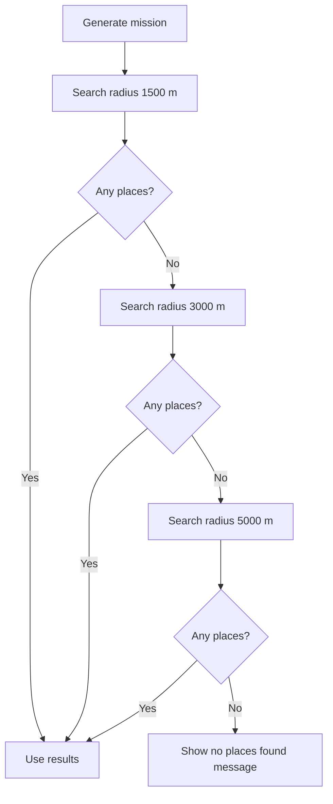

### DTO Mapping

Overpass returns `elements`. The repository maps them to `Place`:

```kotlin
data class Place(
    val id: Long,
    val name: String,
    val lat: Double,
    val lng: Double,
    val category: String
)
```

Only places with:

- name,
- latitude,
- longitude,
- category

are used for mission generation.

## 9. Challenge Generation Rules

### Rule 1: No Recent Repetition

Recently used places from the last 10 missions are excluded.

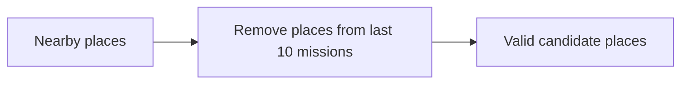

Fallback:

If all places were recently used, the app restores the nearby places list so a mission can still be generated.

### Rule 2: Category Diversity

If the last three missions used the same category, the next mission switches to a different category when possible.

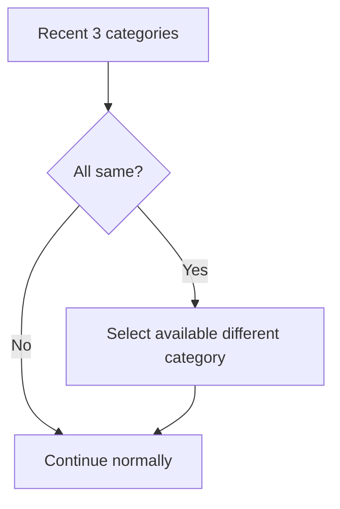

### Rule 3: Time-of-Day Awareness

| Time | Preferred categories |
|---|---|
| 06:00-11:59 | Food |
| 12:00-17:59 | Nature, Culture |
| 18:00-22:59 | Food, Sport |
| Other hours | No time preference |

### Rule 4: Difficulty Evolution

Experienced users get a slightly farther mission.

Condition:

```text
completed missions > 5
```

Selection:

```text
sortedPlaces[sortedPlaces.size / 2]
```

### Rule 5: New-User Proximity

New users receive the nearest target.

Selection:

```text
sortedPlaces.first()
```

## 10. Local Data Storage and History

### Entity

`ChallengeEntity` stores the complete mission state:

```kotlin
@Entity(tableName = "challenges")
data class ChallengeEntity(
    @PrimaryKey(autoGenerate = true) val id: Long = 0,
    val title: String,
    val description: String,
    val category: String,
    val targetLat: Double,
    val targetLng: Double,
    val distanceMeters: Int,
    val status: String,
    val reason: String,
    val targetPlaceName: String = "",
    val generatedAt: Long = System.currentTimeMillis(),
    val completedAt: Long? = null,
    val expiredAt: Long? = null
)
```

### Lifecycle of a Mission

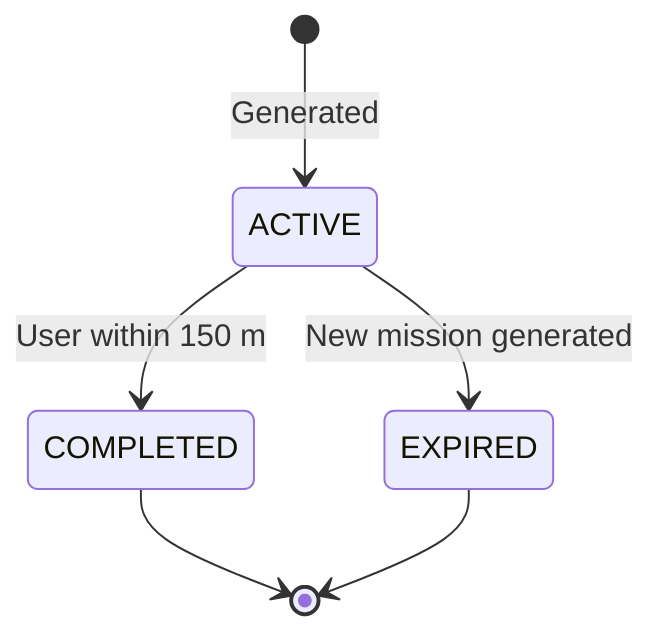

### History Screen Data

The history screen observes:

```kotlin
val historyFlow = challengeDao.getHistoryFlow()
```

Room emits updates automatically when:

- a mission is completed,
- a mission is expired,
- a new active mission replaces the previous one.

## 11. Completion Verification

Completion is manual. The user taps **Check Completion** on the Map screen.

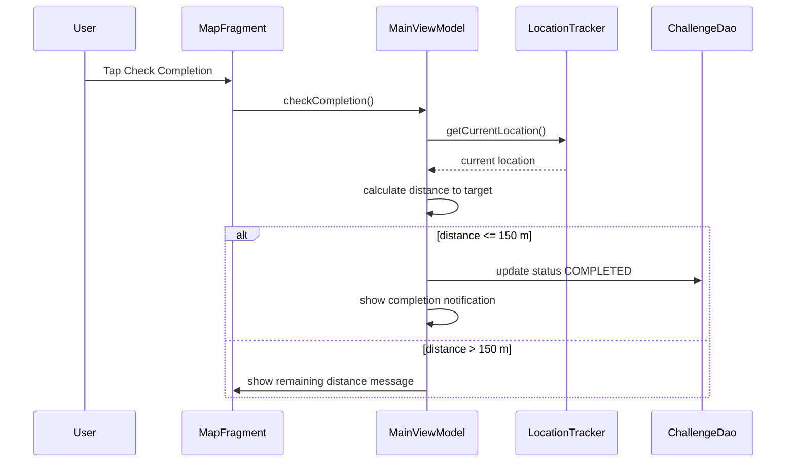

The radius is defined in `MainViewModel`:

```kotlin
const val COMPLETION_RADIUS_METERS = 150
```

## 12. Notifications

Notification permission:

```xml
<uses-permission android:name="android.permission.POST_NOTIFICATIONS" />
```

Notification channel:

```text
mission_updates
```

Events:

| Event | Trigger |
|---|---|
| New exploration mission | After a new mission is inserted |
| Mission completed | After a mission status changes to `COMPLETED` |

Fallback:

If notification permission is denied, the app still shows in-app messages through Toast or Snackbar.

## 13. Tech Stack

| Area | Technology |
|---|---|
| Language | Kotlin |
| UI | XML layouts, View Binding, Material Design 3 |
| Architecture | MVVM with shared `AndroidViewModel` |
| Navigation | Jetpack Navigation + BottomNavigationView |
| Async | Kotlin Coroutines + StateFlow |
| Location | Google Play Services Location |
| Map | osmdroid / OpenStreetMap |
| API | Retrofit + Moshi |
| External data | Overpass API |
| Database | Room + KSP |
| Notifications | Android notification channel + `NotificationCompat` |
| Tests | JUnit local unit tests |

## 14. Unit Tests

The generator tests are in:

```text
app/src/test/java/com/example/cityexplorerchallenge/domain/ChallengeGeneratorTest.kt
```

Covered behavior:

| Test area | Purpose |
|---|---|
| Empty places | No mission is generated |
| Recent repetition | Recently used places are excluded |
| Morning preference | Food places are preferred in the morning |
| Category diversity | Repeated recent category forces another category |
| Experienced user | Farther target is selected |
| New user | Nearest target is selected |

The generator was designed to be testable with pure coordinates:

```kotlin
generateChallenge(
    currentLat = 50.0614,
    currentLng = 19.9366,
    nearbyPlaces = places,
    history = history
)
```

This avoids needing an emulator or real `android.location.Location` object for rule tests.

## 15. Current Limitations

These are intentional or acceptable for the current project scope:

- Completion is checked manually, not through a background geofence.
- The map shows a straight-line direction, not turn-by-turn routing.
- OpenStreetMap Overpass does not provide Google-style ratings.
- Expiration happens when a new mission replaces the active one.
- Room uses destructive migration during development, so schema changes can clear local data.
- Public Overpass API availability depends on network conditions.
